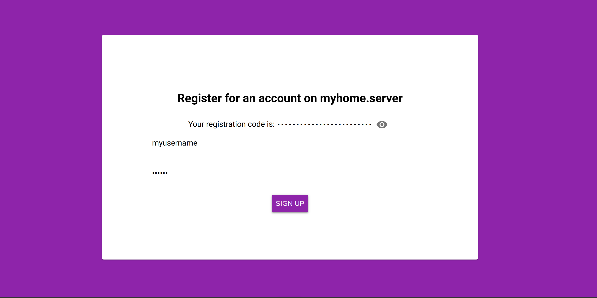

# matrix-invite-panel

An invite token system for Synapse, inspired by
[matrix-registration](https://github.com/zeratax/matrix-registration), with some new additions:

- A web frontend for issues new invites or revoking previously issued ones.
- Automated invite expiration.
- Looks pretty! With easily customizable looks and colors.

## Setup

TODO
